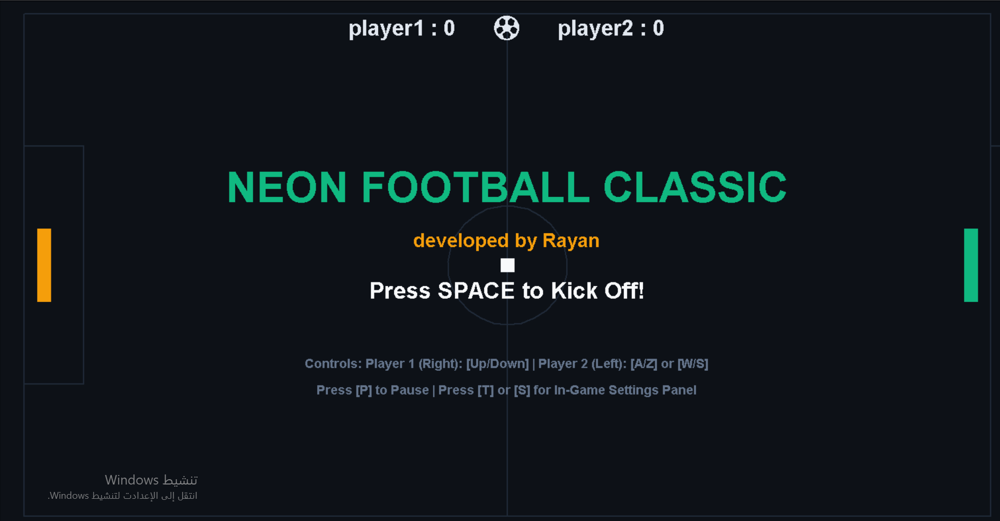
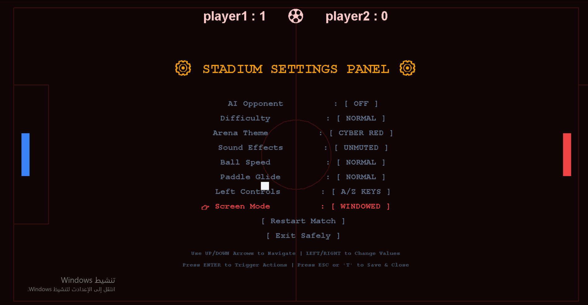

# README — NEON FOOTBALL CLASSIC

````markdown
# ⚽ NEON FOOTBALL CLASSIC — Ultimate Edition

<div align="center">


A futuristic retro-inspired football pong game built with **Python Turtle Graphics**  
featuring professional OOP architecture, AI opponent system, dynamic themes, particle effects,  
sound engine, in-game settings panel, and polished neon visuals.

Developed by **Rayan Shaiaa**

</div>

---

# 📌 Overview

**NEON FOOTBALL CLASSIC** is not just a basic Pong clone.

This project was engineered as a modernized arcade experience that preserves the original gameplay mechanics while introducing:

- Advanced Object-Oriented Programming architecture
- Dynamic game state management
- Real-time particle effects
- Interactive settings system
- AI opponent engine
- Futuristic neon stadium visuals
- Sound effect manager
- Professional modular code structure
- Theme system
- Countdown and overlay systems
- Smooth gameplay optimization

The project demonstrates how classic arcade games can be transformed into polished portfolio-grade software using clean engineering principles.

---

# 🎮 Gameplay

The game is inspired by:

- Classic Pong
- Retro football stadium aesthetics
- Arcade neon experiences

Two paddles compete to score goals by passing the ball beyond the opponent's boundary.

The first player to reach:

```python
MAX_SCORE = 10
````

wins the match.

---

# ✨ Core Features

## 🧠 Professional OOP Architecture

The entire project follows a modular Object-Oriented design.

### Main Classes

| Class                | Responsibility                          |
| -------------------- | --------------------------------------- |
| `GameConfig`         | Stores all constants and configurations |
| `SoundManager`       | Handles audio and sound effects         |
| `Paddle`             | Player paddle behavior                  |
| `Ball`               | Ball movement and physics               |
| `StadiumHUD`         | Stadium rendering and scoreboard        |
| `ParticleSystem`     | Visual neon particle effects            |
| `KeyboardController` | Input handling system                   |
| `FootballGame`       | Main game orchestrator                  |

---

# 🌌 Visual Features

## Neon Stadium Design

The game includes multiple futuristic arena themes:

* EMERALD
* GOLDEN
* CYBER RED
* STEEL

Each theme dynamically changes:

* Background colors
* Paddle colors
* HUD colors
* Stadium lines
* Ball appearance

---

## Particle Effects System

Custom-built particle engine generates visual effects during:

* Paddle collisions
* Wall bounces
* Goal scoring

Features include:

* Randomized velocities
* Dynamic lifetimes
* Neon glow simulation
* Optimized particle pooling

---

# 🔊 Audio Engine

The game contains a fully asynchronous sound system using:

```python
winsound
threading
```

### Sound Events

* Paddle hits
* Wall collisions
* Goal scoring
* Countdown ticks
* Pause / Resume sounds
* Victory fanfare
* Background music support

---

# ⚙️ In-Game Settings Panel

The game includes a fully interactive settings system accessible during gameplay.

## Adjustable Settings

| Setting          | Options                       |
| ---------------- | ----------------------------- |
| AI Opponent      | ON / OFF                      |
| Difficulty       | EASY / NORMAL / HARD / INSANE |
| Arena Theme      | Multiple themes               |
| Sound Effects    | MUTED / UNMUTED               |
| Ball Speed       | SLOW / NORMAL / FAST          |
| Paddle Speed     | SLOW / NORMAL / FAST          |
| Control Bindings | A/Z or W/S                    |
| Screen Mode      | Fullscreen / Windowed         |

---

# 🤖 AI Opponent System

The game includes a configurable AI engine.

### Difficulty Scaling

| Difficulty | Behavior                         |
| ---------- | -------------------------------- |
| EASY       | Slow reaction                    |
| NORMAL     | Balanced                         |
| HARD       | Fast tracking                    |
| INSANE     | Aggressive near-perfect tracking |

AI logic dynamically adjusts:

* Tracking speed
* Reaction margin
* Ball speed multiplier

---

# 🕹️ Controls

## Player 1 (Right Paddle)

| Key | Action    |
| --- | --------- |
| ↑   | Move Up   |
| ↓   | Move Down |

---

## Player 2 (Left Paddle)

### Option 1

| Key | Action    |
| --- | --------- |
| A   | Move Up   |
| Z   | Move Down |

### Option 2

| Key | Action    |
| --- | --------- |
| W   | Move Up   |
| S   | Move Down |

---

## Global Controls

| Key   | Action          |
| ----- | --------------- |
| SPACE | Start / Restart |
| P     | Pause           |
| T     | Open Settings   |
| S     | Open Settings   |
| ESC   | Exit Settings   |

---

# 🧩 Technical Highlights

## Physics System

The game preserves the original arcade collision behavior while improving responsiveness.

Features include:

* Progressive ball acceleration
* Accurate paddle hit detection
* Collision anti-sticking protection
* Dynamic rebound calculations

---

## Performance Optimization

Several optimizations were implemented:

* Manual rendering using:

```python
tracer(0)
```

* Dedicated particle pooling
* Asynchronous audio threads
* Isolated HUD rendering
* Low-latency update loop

---

# 🏗️ Project Structure

```bash
NEON-FOOTBALL-CLASSIC/
│
├── لعبه الكورة.py  
├── README.md
│
└── images/
```

---

# 🚀 Installation

## 1. Clone Repository

```bash
https://github.com/RayanShaiaa-cmd/-NEON-FOOTBALL-CLASSIC-Ultimate-Edition.git
---

## 2. Navigate Into Project

```bash
cd neon-football-classic
```

---

## 3. Run The Game

```bash
لعبه الكوره.py
```

---

# 🧪 Requirements

## Python Version

```text
Python 3.x
```

## Libraries Used

### Built-in Libraries Only

```python
turtle
time
random
threading
winsound
os
```

No external dependencies required.

---

# 🎨 Design Philosophy

This project was designed around several engineering goals:

* Maintain original gameplay feel
* Modernize visual presentation
* Demonstrate clean architecture
* Showcase advanced Python OOP
* Build portfolio-quality software
* Achieve responsive real-time interaction

---

# 📈 Skills Demonstrated

## Software Engineering

* Object-Oriented Programming
* State Management
* Modular Architecture
* Event-Driven Programming
* Real-Time Systems

---

## Game Development

* Collision Systems
* Game Loops
* Input Handling
* HUD Systems
* Visual Effects
* Difficulty Scaling

---

## Python Expertise

* Turtle Graphics
* Threading
* Asynchronous Sound Handling
* Performance Optimization
* Clean Code Principles

---

# 🧠 Educational Value

This project is useful for learning:

* Game architecture fundamentals
* OOP design in Python
* Real-time rendering concepts
* Interactive systems engineering
* Arcade physics simulation

---

# 📸 Screenshots

## Main Interface



> Futuristic neon-themed kickoff screen with dynamic arena visuals, score tracking system, and immersive cyber-style presentation.

---

## Stadium Settings Panel



> Advanced in-game settings panel featuring AI controls, arena customization, gameplay tuning, sound management, and fullscreen/windowed display configuration.
---

# 🔮 Future Improvements

Potential future upgrades include:

* Online multiplayer
* Power-up mechanics
* Animated menus
* Mouse support
* Better AI prediction system
* Custom stadium editor
* Advanced shaders
* Score history system
* Controller support
* Cross-platform audio engine

---

# 👨‍💻 Author

## Rayan Shaiaa

AI Student • Software Developer • Game Systems Enthusiast

Focused on:

* Artificial Intelligence
* Data Science
* Software Engineering
* Game Development
* Computer Vision

---

# 📜 License

This project is open-source and available under the MIT License.

---

# ⭐ Final Note

NEON FOOTBALL CLASSIC was built as a demonstration of how a simple arcade concept can evolve into a professionally engineered software project while preserving its original gameplay identity.

If you like this project, consider giving it a ⭐ on GitHub.

```
```
